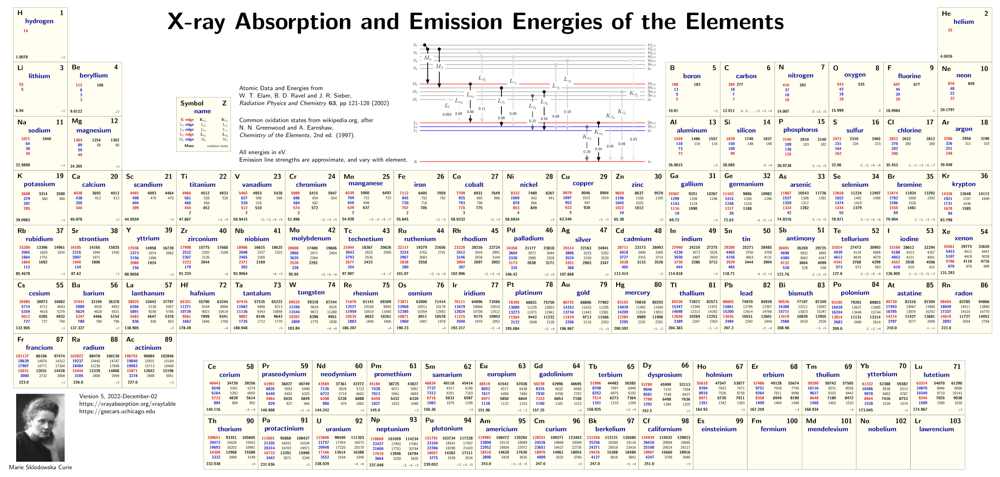

# Fundamental-Laboratory-Experiment-in-Nuclear-Electronics-II

核相关基础实验I的仓库链接在这里[Fundamental-Laboratory-Experiment-in-Nuclear-Electronics-I](https://github.com/Xuanyiyiren/Fundamental-Laboratory-Experiment-in-Nuclear-Electronics)。

核相关基础实验II相比于基础实验I，更专注于使用探测器探测放射源的实际训练。而实验I更专注于探测器内部的电子学结构的探究和验证，属于纯粹的探测器电子学方面的。这次节奏就比实验I好多了，两周做一轮实验，大多是实验可以一周完成。

本次实验我全部的数据处理都使用python完成。origin固然也是非常好的数据处理软件，绝大部分学生是使用origin软件完成的数据分析。但是由于origin封装程度太高导致很多功能用起来不明所。而且一些功能也并没有做的很好，用起来也不能随心所欲。所以我使用python来完成数据分析。当然这个过程也是比较困难的，因为我的同学们都用origin来分析数据，此外老师们对python数据分析也没有很深入的了解，实际上核工程核技术这一领域似乎也缺乏好用的pypline（这就比较羡慕天体物理了，有着astropy等专业化流水线数据处理工具包）。这导致许多功能都我自己摸索着来实现，由于缺乏例如峰谱分析等高阶数据处理课程的专业知识，我的一些做法也可能是不合适的，这里也恳请大家指出。

- 实验1和实验8作为同一轮次：
  - 实验1是探究了核辐射的统计学规律，反复测量了固定时间内的放射源计数，使用Pearson- $\chi^2$ 检验法检验计数率较高时分布符合Gauss分布，而计数率较低时符合Poisson分布。
  - 实验8则探究了探测器距离、屏蔽层厚度对探测计数率的影响，借此验证了一些辐射防护手段的有效性。
- 实验2则是关于 $\gamma$-射线和物质的相互作用的。就是测量不同厚度的屏蔽材料后射线的计数率，绘制吸收曲线并使用指数衰减拟合求出不同材料对 $\gamma$-射线的线性吸收系数。本实验中指导学生进行带误差的线性拟合，实际上这就是在`scipy.optimize.curve_fit`的拟合函数中加上`sigma`参数即可。讲义中要求从带误差拟合公式手动计算一遍，将结果和origin的对比。这部分内容我只是写在里我上交的报告中，并没有写在这里的报告里面。主要是我之前就了解过带误差拟合，觉得这部分比较trivial。
- 实验3是探究了康普顿散射的微分截面，这部分倒还挺有意思的，通过实验验证了Klein-Nishina公式，即验证量子场论的一个结果。
- 实验4是 $\alpha$ 射线的探究。先要在固定条件下和不同偏压下测量能谱的分辨率，选择出最佳的偏压。然后再定标。然后利用腔室内的气压等效射程，测量了射线强度和入射深度的关系，得到了 $\alpha$ 射线在空气中的射程。
- 实验5是 $\beta$ 射线的探究，这个实验也很有意思
  - 这次不需要确定最佳参数，直接定标，这次的定标方法也是比较独特，使用一个已知放射源和一台精密脉冲发生器（一般都是两个或多个已知能量的放射源）。
  - 就是 $\beta$ 能谱是连续谱[^1]独特的处理方法，不同于离散谱直接用寻峰和峰拟合的处理办法，这里需要利用库里厄图(Kurie plot)确定 $\beta$ 衰变的Q值。
  - 另外就是一个实验中遇到的问题，按理说从 $\rm ^{137}Cs$ 的 $\beta$ 衰变的半衰期来看，这个库里厄图是需要一阶能量因子修正的。库里厄图应该是一条斜向下的直线，修正之前本来是挺直的，但是修正后反而更弯了。我是推断不出来什么原因的，请教老师后才知道这是半导体探测器的晶格缺陷造成的能谱畸变，使得低能段更容易被探测到，导致本来理论上是直线的图，探测器测量后就应该变弯，所以修正后变弯反而是正常的。
- 实验6是 X 射线荧光光谱分析，先在不同的成型时间下测量分辨率来确定最佳成形时间的，然后用放射源激发不同已知元素的特征 X 射线（荧光光谱）来定标，最后是测量了一些样品（例如一元人民币等）的荧光光谱来推定性测物质组成。当然缺乏专业光谱分析的知识，这个推测全凭同学们随意。话说这个活化学系的同学们应该更熟吧。
- 实验7是符合法测量放射性活度。

[^1]: $\beta$ 衰变的连续谱问题是核物理以及高能物理中的具有里程碑意义重要话题。这在当时是极为轰动的，因为连续谱和能量量子化是直接矛盾的。当时对此有很多种解释，甚至有人放弃能量守恒定律。不过最终还是中微子的预言和发现解决了这个问题。

在实验的过程中我和我的一个朋友找到了一些好用的工具包：

- [livechart API](https://www-nds.iaea.org/relnsd/vcharthtml/api_v0_guide.html):包含了各种核素的信息，例如放射性同为素的半衰期，产生的射线类型和强度，不同衰变道的衰变率等等
- [lmfit](https://lmfit.github.io/lmfit-py/intro.html):一个专注于曲线拟合的包。内置了常用的峰函数模型。拟合的报告也非常详细，包括拟合参数的值和置信区间、拟合的$\chi^2$量和决定系数 $R^2$ 等，scipy.optimize.curve_fit似乎只提供了参数的值和置信区间，决定系数还要自己算。更关键的，对于内置的模型（文档中叫build-in model）可以自动猜初值！这就太爽了，之前做拟合时候被初值折磨的极度痛苦，origin初值是在包含在用户自建函数的设置里面，也就是同样的函数不同的初值在origin里面算两个用户自建函数！每次调整初值都是二重折磨。
- [roentgen](https://roentgen.readthedocs.io/en/latest/index.html):一个X射线相关的Database工具包，包含元素的特征X射线、不同材料的X射线吸收系数等。Documentation也写得非常不错，有很多示例，还兼容[astropy的单位运算](https://docs.astropy.org/en/stable/units/)以及QTable，非常不错。X射线的是原子物理问题不是原子核物理问题，所以livechart API中不会提供X射线的数据。
- [X-ray DB](https://xraypy.github.io/XrayDB/):也是一个X射线相关的Database工具包，感觉功能比roentgen差一点（roentgen有一个函数可以根据能量范围自动查找可能的特征X射线，而X-ray DB只能调出数据来手动筛选）。不过他们基于元素周期表用tikz做了一个很漂亮的不同元素的特征X射线的的图，它们的documentation里面有[png格式的图](https://xraypy.github.io/XrayDB/periodictable.html#periodic-tables)，在[他们的github仓库的poster目录](https://github.com/xraypy/XrayDB/tree/master/poster)里面可以找到 $\LaTeX$ 源代码。下面这个就是我利用它们的源代码编译导出的pdf，再利用python包`fitz`转成svg的效果[^2]。这张图里面右下角是居里夫人的照片，他们在源代码里面还提供了其它科学家的照片的tex文件。

[^2]:涉及 $\LaTeX$ 公式的pdf转svg的效果好像大多都不怎么好，很多都存在字体的问题，当然这里面的问题就比较复杂了，我自己也不是很懂。

最后补充一下，虽然实验I的报告是电子版，但是本课程的报告最初要求是手写。好在经过我去和老师argue，老师同意了使用电子报告。我的第一个实验（实验7）是手写的，所以里面并没有提供电子报告，而且由于我不是很乐意手写报告，这一个实验的分析也做的比较简单。
